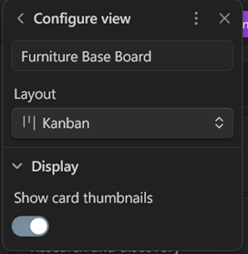
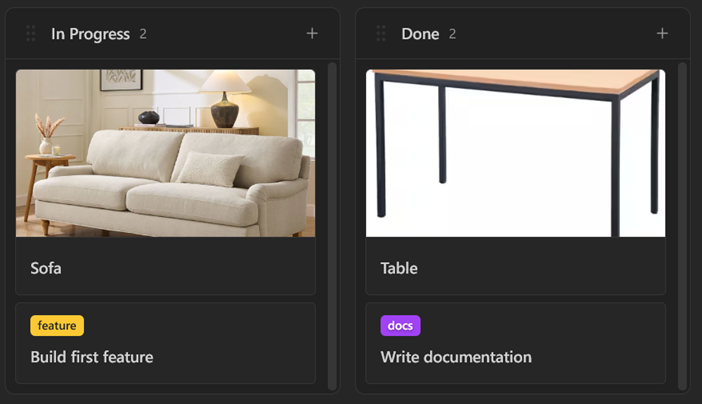

# Card Thumbnails

Base Board can optionally show a thumbnail at the top of each Kanban card.

Enable it per Kanban view:

1. Open the board.
2. Open **Configure view**.
3. Expand **Display**.
4. Turn on **Show card thumbnails**.

## How it works

- Thumbnails are off by default.
- The setting is saved with the Kanban view configuration in the `.base` file.
- When enabled, Base Board uses the first image found in the note body.
- It supports both Obsidian embeds like `![[photo.png]]` and standard Markdown images like ``.
- Internal vault images are resolved through Obsidian link resolution, and external image URLs are also supported.
